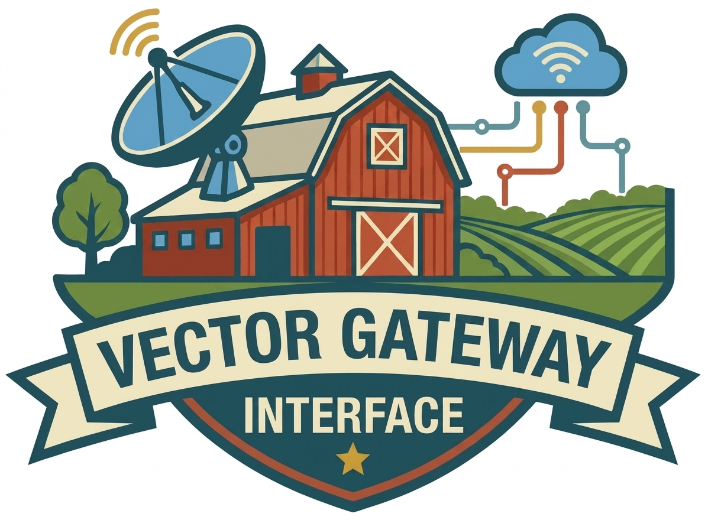

# VGI (Vector Gateway Interface) — Rust

<p align="center">
  
</p>

<p align="center">
  <strong>Add your own functions and tables to DuckDB — written in Rust, shipped as one binary.<br/>
  No C++ extension to compile, no linking against DuckDB, no version coupling.</strong>
</p>

<p align="center">
  Created by <a href="https://query.farm">Query.Farm</a>
</p>

---

A **VGI worker** is a small Rust program that DuckDB talks to over Apache Arrow IPC.
It can expose scalar / table / aggregate functions and whole catalogs (schemas,
tables, views) that behave like native DuckDB objects. DuckDB launches your worker
for you when a query needs it — you never run a server by hand.

This repo is the **Rust** worker SDK ([`vgi`](https://crates.io/crates/vgi)). It is
byte-for-byte wire-compatible with the canonical
[Python](https://github.com/Query-farm/vgi-python) SDK, so a Rust worker
drops in behind the same `ATTACH ... (TYPE vgi)`. Built on
[`vgi-rpc`](https://crates.io/crates/vgi-rpc); stock `arrow-rs` 59.x, **MSRV 1.97**.

## Why a worker instead of a C++ extension?

| Traditional DuckDB extension | VGI worker |
|------------------------------|------------|
| Written in C/C++, compiled and linked against DuckDB | Written in Rust, one standalone binary |
| Must be rebuilt for each DuckDB version | Version independent |
| Complex build / signing / release cycle | `cargo build`, ship the binary |
| Runs in-process | Process isolation |

**Reach for it when you want to:** call REST APIs from SQL, run ML inference,
expose an external database / API / filesystem as a queryable catalog, or ship
domain-specific functions to your team as a single binary.

## Your first worker

**1. Create a project and add the dependencies:**

```toml
# Cargo.toml
[dependencies]
vgi = "0.22"
vgi-rpc = "0.15"
arrow-array = "59"
arrow-schema = "59"
```

**2. Write a function and serve it:**

```rust
// src/main.rs
use std::sync::Arc;

use arrow_array::{cast::AsArray, ArrayRef, RecordBatch, StringArray};
use arrow_schema::DataType;
use vgi::{ArgSpec, FunctionMetadata, ProcessParams, ScalarFunction, Worker};
use vgi_rpc::{Result, RpcError};

/// `upper_case(s)` — uppercase a string column.
struct UpperCase;

impl ScalarFunction for UpperCase {
    fn name(&self) -> &str {
        "upper_case"
    }

    fn metadata(&self) -> FunctionMetadata {
        FunctionMetadata {
            description: "Convert string values to uppercase".into(),
            return_type: Some(DataType::Utf8),
            ..Default::default()
        }
    }

    fn argument_specs(&self) -> Vec<ArgSpec> {
        vec![ArgSpec::column("value", 0, "varchar", "String to uppercase")]
    }

    fn process(&self, params: &ProcessParams, batch: &RecordBatch) -> Result<RecordBatch> {
        let col = batch.column(0).as_string::<i32>();
        let upper: StringArray = col.iter().map(|v| v.map(str::to_uppercase)).collect();
        let out: ArrayRef = Arc::new(upper);
        RecordBatch::try_new(params.output_schema.clone(), vec![out])
            .map_err(|e| RpcError::runtime_error(e.to_string()))
    }
}

fn main() {
    let mut worker = Worker::new();
    worker.register_scalar(UpperCase);
    worker.run(); // serves stdio (default), --unix <path>, or --http
}
```

**3. Build it** (`cargo build --release`), **then call it from a DuckDB engine
that has the `vgi` extension.** The `vgi` extension currently ships with Query
Farm's [Haybarn](https://github.com/Query-farm-haybarn/haybarn) DuckDB
distribution, which starts with no install via `uvx haybarn-cli`. From your
project directory:

```sql
-- Haybarn ships the `vgi` extension. DuckDB LAUNCHES the worker for you;
-- LOCATION is the command it runs, and the alias 'demo' is what you
-- qualify functions with in SQL.
ATTACH 'demo' (TYPE vgi, LOCATION './target/release/my-worker');

SELECT demo.main.upper_case(name) FROM (VALUES ('alice'), ('bob')) t(name);
-- ALICE
-- BOB
```

> **`LOCATION` gotcha:** the path is resolved relative to DuckDB's working
> directory, not your project. If the worker isn't found, use an absolute path.

### Iterating

Change your Rust, rebuild, and re-attach — DuckDB pools the worker per attachment,
so `DETACH demo; ATTACH 'demo' (...)` (or a fresh session) picks up a new build.

### Troubleshooting

- **`ATTACH` can't find the worker** — `LOCATION` is relative to DuckDB's working
  directory; use an absolute path.
- **`Catalog Error: ... does not exist`** — qualify with the attach alias
  (`demo.main.upper_case`) or run `USE demo;`.
- **Runtime / type errors** — errors returned from `process` (and bind-time
  `argument_specs` type checks) surface directly in DuckDB's error message.

## Function types

| Type | Trait | SQL pattern | Use case |
|------|-------|-------------|----------|
| **Scalar** | `ScalarFunction` | `SELECT f(col) FROM t` | Per-row transforms (1:1) |
| **Table** | `TableFunction` | `SELECT * FROM f(args)` | Generate / scan data |
| **Table-In-Out** | `TableInOutFunction` | `SELECT * FROM f((SELECT …))` | Streaming transforms |
| **Table-Buffering** | `TableBufferingFunction` | `SELECT * FROM f((SELECT …))` | Aggregate-then-emit (sink → combine → source) |
| **Aggregate** | `AggregateFunction` | `SELECT f(col) … GROUP BY …` | Grouped / window / streaming aggregates |

Each trait is small: `name`, `metadata`, `argument_specs`, an `on_bind` to resolve
the output schema, and `process` (or the buffering / aggregate lifecycle methods).
Projection & filter pushdown, ORDER BY / TABLESAMPLE hints, settings, secrets,
bearer auth, and a cross-process state store are handled for you.

## Beyond functions: full catalogs

`Worker::set_catalog` exposes a complete catalog — schemas, function-backed
**tables**, **views**, and **macros** — with constraints, column statistics, time
travel (`AT`), and secondary catalogs attachable by name:

```sql
ATTACH 'external_db' (TYPE vgi, LOCATION './my-catalog-worker');

SELECT * FROM external_db.main.users;            -- a function-backed table
SELECT * FROM external_db.analytics.daily_view;  -- a view
SELECT external_db.main.transform(col) FROM t;   -- a function
```

## Transports

`Worker::run` picks the transport from argv: **stdio** (default), **Unix socket**
(`--unix <path>`, the launcher contract), or **HTTP** (`--http`, Arrow-IPC over
HTTP with AEAD-sealed stateless stream tokens and optional bearer auth).

## Protocol overview

VGI uses [`vgi-rpc`](https://crates.io/crates/vgi-rpc), an Apache-Arrow-IPC RPC
framework, for all DuckDB ↔ worker communication. You don't write to this
directly — the traits handle it — but here's what happens per query:

```
DuckDB (client)                      VGI worker
  │──── bind(request) ─────────────▶ │  function name, args, input schema
  │◀─── BindResponse ───────────────  │  output schema (your on_bind)
  │──── init(request) ─────────────▶ │  start the processing stream
  │◀─── stream header ──────────────  │  execution_id, max_workers
  │──── process(batch) ────────────▶ │
  │◀─── output batch ───────────────  │  your process(batch)
  │──── [stream close] ────────────▶ │
```

## Workspace layout

| crate | published | summary |
|-------|:---------:|---------|
| [`vgi/`](vgi/) | ✅ [crates.io](https://crates.io/crates/vgi) · [docs.rs](https://docs.rs/vgi) | The worker SDK: function models, declarative catalogs, wire dispatch, transports. |
| `vgi-example-worker/` | — | A fixture worker registering every function kind and full catalogs; drives the integration suite. `publish = false`. |

Read `vgi-example-worker/src/` for a working example of every trait — scalar,
table, table-in-out, buffering, aggregate, and catalog-backed tables/views.

## Testing your own worker

The fastest check is to call your function from a DuckDB session (see "Your first
worker"). For automated tests, drive the worker from Rust with `vgi-rpc`'s client,
or shell out to a DuckDB session from your test harness.

## Running the SDK's integration suite (contributors)

The full behavioral suite is the canonical **VGI C++ integration suite**
(`test/sql/integration/*` in the `vgi` extension repo), which drives DuckDB's
`unittest` binary against the example worker. It passes across all three transports
(8176 assertions on subprocess, 7774 on HTTP, 0 failures):

```sh
cargo build --release
scripts/run_tests.sh            # subprocess transport, full in-scope suite
LAUNCH=1 scripts/run_tests.sh   # launcher (Unix socket) transport
scripts/run_http_tests.sh       # HTTP transport
```

`cargo fmt` / `clippy` / `build` / `doc` run in CI.

## Development

`vgi` depends on the published `vgi-rpc` from crates.io. To develop against an
unreleased `vgi-rpc` checkout, add an **uncommitted** patch to the root
`Cargo.toml`:

```toml
[patch.crates-io]
vgi-rpc = { path = "../vgi-rpc-rust/vgi-rpc" }
```

```sh
cargo build --workspace
cargo clippy -p vgi --all-targets --all-features -- -D warnings
cargo test --doc -p vgi
cargo fmt --all
```

## License

Query Farm Source-Available License v1.0 — see [LICENSE](LICENSE).
Copyright © 2025, 2026 Query Farm LLC.
